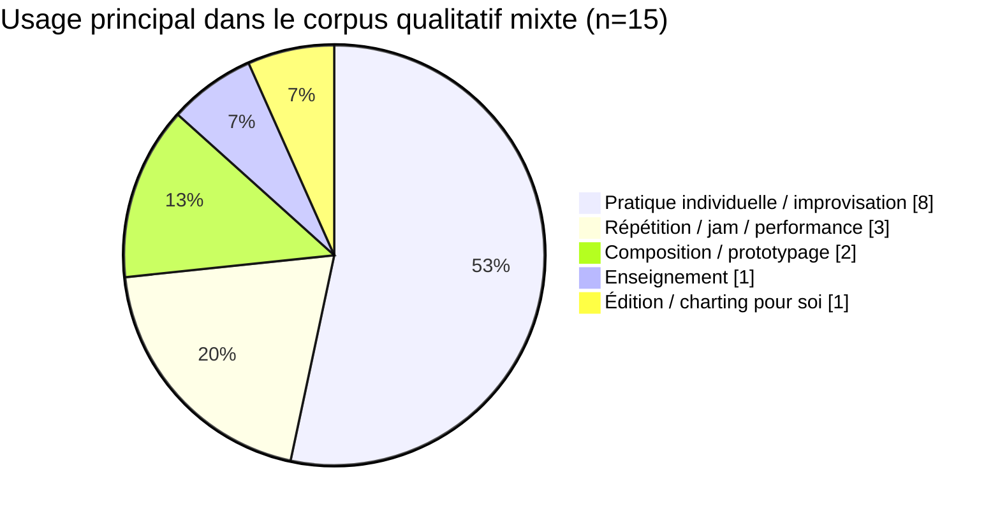
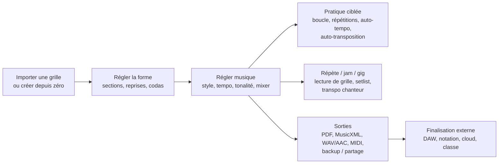

# Usages typiques d’iReal Pro et exigences minimales pour un remplaçant

## Résumé exécutif

iReal Pro n’est pas, dans les faits, un logiciel de notation complet ni un mini-DAW. C’est d’abord un **hybride entre recueil de grilles, moteur d’accompagnement génératif et outil de pratique harmonique portable**. Sa proposition centrale est très stable sur toutes les sources officielles : disposer de milliers de grilles, les éditer vite, les transposer, et jouer immédiatement dessus avec un accompagnement réglable, sur mobile, tablette ou ordinateur, y compris hors ligne. citeturn4view7turn3view3turn4view0turn8view2turn8view3turn27view0

Les usages les plus typiques sont, par ordre d’importance, **la pratique individuelle**, puis **la sécurisation des répétitions/jams/gigs** par lecture de grilles et changement de tonalité rapide, puis **l’enseignement**, et enfin **le prototypage de compositions / backing tracks simples**. Les étudiants l’emploient surtout pour les standards, l’improvisation, le travail en plusieurs tonalités et la mémorisation du form ; les professeurs pour distribuer des playlists d’exercices et faire jouer les élèves en présentiel ou à distance ; les amateurs pour pratiquer seuls, chanter dans la bonne tonalité et disposer d’une “fausse partition” simple ; les semi-pros et pros pour garder un “roadmap harmonique” dans la poche, dépanner une tonalité sur scène et exporter rapidement grilles ou audios. citeturn13view1turn13view0turn11view0turn18view0turn19view0turn4view0turn17view0turn35view2turn0search5turn0search8

Pour qu’un remplaçant soit crédible, le **minimum** n’est pas “de meilleures sonorités” en premier lieu. Le seuil d’entrée, c’est plutôt : **importer la bibliothèque existante**, afficher des **grilles lisibles**, permettre un **édition rapide de la forme**, offrir un **playback fiable** avec tempo/boucle/répétitions/transposition/mute/mixer, fonctionner **hors ligne**, et sortir proprement des **PDF, MusicXML, audio et MIDI** avec sauvegarde robuste. Les discussions récentes autour d’alternatives convergent d’ailleurs explicitement sur trois attentes : meilleur playback, meilleur rendu/éditing des grilles, et import des charts iReal. J’en déduis que la compatibilité de bibliothèque est une exigence de migration, pas un bonus. citeturn35view0turn35view1turn27view0turn23search1turn23search2turn6search9

Les principaux leviers de différenciation au-delà de cette parité minimale sont connus : **meilleur groove/audio**, **formes longues et plus flexibles**, **meilleure intégration DAW / plugins / sync**, et **licence plus simple entre plateformes**. Les limites actuelles les plus documentées sont l’absence de placement rythmique sur contretemps, la limite à une page lue par le Player, l’impossibilité d’importer PDF/MIDI/MusicXML pour créer une grille, l’absence de styles utilisateur, la sync Android non native, et une intégration mobile audio/plug-in incomplète. citeturn20view0turn20view1turn20view2turn6search1turn20view3turn21view0turn26search1turn25search16

## Base factuelle et méthode

Cette analyse repose sur un corpus hiérarchisé : d’abord la documentation officielle produit/support pour établir le socle fonctionnel et les limites avérées ; ensuite les fiches des boutiques mobiles pour les signaux quantitatifs, le prix et les avis ; puis des forums spécialisés, tutoriels et billets de praticiens pour les workflows réels ; enfin quelques sources pédagogiques et académiques pour vérifier l’usage en enseignement. Le résultat est robuste pour répondre à la question “à quoi sert typiquement iReal Pro ?” ; il ne doit pas être lu comme une étude de marché statistique exhaustive. citeturn4view7turn3view3turn4view0turn13view1turn13view0turn13view2turn17view0turn35view2

Au moment de la consultation, l’éditeur revendique **2 000 000+ musiciens** utilisateurs et un modèle **achat unique, sans abonnement**. La fiche iOS française affiche **4,8/5 pour 2,8 k notes**, tandis que la fiche Android française affiche **4,7/5** et **500 k+ téléchargements**. Ces chiffres confirment surtout deux choses : la base installée est large, et le logiciel a atteint le statut d’outil standard malgré des critiques récurrentes sur l’audio et certaines limites éditoriales. citeturn4view7turn24search4turn4view0turn19view0

## Usages typiques par profil

Le point commun à presque tous les profils est que la valeur perçue ne vient pas d’une “belle partition”, mais d’une **grille exploitable immédiatement** : lisible, transposable, jouable, partageable. C’est ce qui explique pourquoi la fonction d’édition est si importante même chez des utilisateurs qui téléchargent déjà beaucoup de charts : les grilles communautaires sont utiles, mais elles sont fréquemment corrigées, simplifiées, réharmonisées ou adaptées à une tonalité/interprète précis. citeturn4view7turn17view0turn17view2turn18view0

| Profil | Usage dominant | Ce qu’iReal Pro apporte aujourd’hui | Ce qu’un remplaçant doit au minimum préserver |
|---|---|---|---|
| Étudiants en jazz / musiques actuelles | Travailler les standards, l’improvisation, la lecture de grilles, les tonalités, les sections difficiles | Boucles, tempo, répétitions, transposition automatique, suggestions de gammes, playback de section rythmique, exercices/playlist | Boucle fiable, changement de tonalité rapide, affichage clair du form, moteur de playback stable, import de gros répertoires |
| Professeurs / écoles | Distribuer des exercices, faire jouer les élèves, cours en classe ou à distance | Playlists pédagogiques, screensharing/stream, remise institutionnelle, usage en visioconférence | Gestion de classes/listes, partage simple, faible friction de prise en main, mode hors ligne, réglages de latence pour cours à distance |
| Musiciens amateurs | Pratiquer seul, chanter dans la bonne tonalité, répéter avec une “section rythmique” simple | Bibliothèque de grilles, transposition pour voix, ralentissement, loop, mixeur/mute, export audio/PDF | Temps d’accès quasi immédiat, UX simple, bons presets de styles, rendu lisible sur tablette/téléphone |
| Semi-pros / pros | Avoir un roadmap harmonique portable, sécuriser un jam/gig, exporter vite une grille ou un backing simple | Lecture de chart en situation, changement de tonalité pour chanteur, setlists, export PDF/MIDI/audio, adaptation par playlist | Import des bibliothèques existantes, robustesse scénique, export rapide, lisibilité excellente, sauvegarde solide, prix/licence sans surprise |

*Base documentaire du tableau* : pages officielles produit/support, page éducation, avis des stores, discussions de forums jazz/bass, et usage académique en cursus d’improvisation. citeturn13view1turn13view0turn11view0turn18view0turn19view0turn4view0turn17view0turn35view2turn0search5turn0search8

En codant le **motif principal** de 15 items publics du corpus mixte, on obtient un signal très net : iReal Pro est d’abord un outil de **pratique individuelle**, loin devant les usages purement pédagogiques ou purement compositionnels. Ce graphique ne mesure pas des parts de marché ; il visualise seulement la dominante du corpus étudié. citeturn4view7turn8view3turn13view1turn18view0turn19view0turn4view0turn17view0turn0search5turn0search8turn35view2

La leçon pratique est simple : un remplaçant qui échouerait sur la **pratique solo** — démarrage rapide, loop, tempo, répétitions, tonalités, mixer, lisibilité — manquerait son marché principal, même avec un meilleur moteur sonore. citeturn8view3turn4view7turn35view0turn35view1

## Fonctionnalités qui structurent réellement l’usage

Ce qui “verrouille” l’usage n’est pas une seule fonction, mais l’enchaînement de plusieurs blocs. iReal Pro combine une bibliothèque abondante, un éditeur de forme, un player suffisamment flexible, plusieurs sorties de partage/export, et une interface qui reste exploitable sur téléphone, tablette et desktop. C’est cet assemblage qui crée la dépendance d’usage. citeturn4view7turn3view3turn4view0turn27view0

| Bloc fonctionnel | Ce qui fait la valeur | Limites actuelles documentées |
|---|---|---|
| Bibliothèque de grilles | Milliers de grilles gratuites via forums et playlists essentielles, accessibles hors ligne après import | Qualité hétérogène des charts communautaires ; recherche jugée parfois primitive ou un peu lourde |
| Éditeur de grilles / forme | Création rapide, marques de répétition, lettres de répétition A/B/C/D, codas, doubles barres, intro/verse, duplication | Pas de contretemps/8e pour les changements d’accord ; chart limitée à une page jouée par le Player |
| Playback / pratique | Une cinquantaine de styles inclus, mixeur, mute par instrument, tempo, répétitions, loop, auto-tempo, auto-transposition, transposition instruments, click/métronome | Création de styles utilisateur impossible ; alternance de styles dans le morceau seulement via quelques “dual styles” et contournements |
| Référence harmonique | Diagrammes guitare/ukulélé/piano, suggestions de gammes, notation chiffrée, thèmes clair/sombre, VoiceOver | Mélodie/lyrics absents ; personnalisation des voicings utilisateur non spécifiée comme disponible dans les docs consultées |
| Import / export / partage | Export PDF, MusicXML, WAV/AAC/MIDI, playlists et backups ; protocole d’URL et format iReal pour l’écosystème ; sauvegarde manuelle/cloud | Import direct de PDF, audio, MIDI ou MusicXML pour créer une grille non pris en charge ; format Guitar Pro non spécifié officiellement |
| Intégration de production / cours | Workflow documenté vers DAW/notation, enregistrement rapide au micro, usage en visioconférence | Support plugin natif VST/AU/AUv3 non spécifié ; compatibilité IAA/Audiobus/AUM limitée sur iOS récents selon le support |

*Base documentaire du tableau* : documentation officielle produit, centre d’aide, docs développeur, avis utilisateurs et tutoriels/blogs. citeturn4view7turn8view2turn8view3turn8view4turn20view0turn20view1turn20view2turn20view3turn20view4turn20view6turn23search1turn23search2turn27view0turn36view0turn17view2turn4view0

Deux points méritent d’être isolés. D’abord, **la lead-sheet notation complète n’est pas le cœur du produit actuel** : l’aide officielle explique que la mélodie et les paroles ne sont pas incluses pour des raisons de copyright, et recommande en pratique le split-screen avec un PDF, ou l’export MusicXML vers un logiciel de notation si l’on veut enrichir la grille. Cela veut dire qu’un remplaçant n’a pas absolument besoin d’être un “vrai notation editor” pour remplacer iReal Pro ; en revanche, s’il ajoute proprement une couche mélodie/paroles, il dépasse clairement le baseline. citeturn36view0turn35view2

Ensuite, **l’interopérabilité iReal elle-même est déjà un mini-écosystème** : export/import en HTML iReal, playlists, backups, et même un protocole/documentation pour lancer des recherches ou intégrer des chansons/playlists depuis des apps ou sites. Un remplaçant qui ignorerait cet héritage imposerait un coût de migration très élevé. citeturn23search1turn27view0turn35view0turn35view1

## Exigences minimales pour un remplaçant

Le tableau ci-dessous priorise les attentes en distinguant ce qui est **indispensable à la parité d’usage** de ce qui est surtout **différenciant**. Le critère n’est pas “ce qui serait agréable”, mais “ce qui empêcherait réellement un utilisateur d’abandonner iReal Pro”. citeturn35view0turn35view1turn4view7turn17view0turn19view0

| Priorité | Exigence | Seuil minimal crédible |
|---|---|---|
| Indispensable | Migration de bibliothèque | Import des exports iReal / playlists / backups ; sinon le coût de re-saisie est trop élevé |
| Indispensable | Bibliothèque + recherche + playlists | Import massif, recherche rapide, organisation par setlists/cours/gigs, fonctionnement hors ligne |
| Indispensable | Éditeur de grilles réellement rapide | Saisie des accords, reprises, codas, sections A/B, duplication, correction simple des charts communautaires |
| Indispensable | Playback de pratique | Tempo, répétitions, boucle, transposition, transposition instruments, mute/mixer, styles immédiatement exploitables |
| Indispensable | Lisibilité scénique et pédagogique | Très bonne lecture sur téléphone/tablette/desktop, dark mode, grande taille de texte, sélection rapide du morceau |
| Indispensable | Export / partage | PDF + MusicXML + audio + MIDI au minimum ; partage simple avec un groupe ou une classe |
| Indispensable | Sauvegarde / persistance | Backup local simple, restauration fiable, sync cloud claire ou, à défaut, export/import robustes |
| Indispensable | Politique prix/licence claire | Achat unique ou abonnement très transparent ; pas de surprise de relicensing entre appareils d’un même OS |
| Important | Qualité audio supérieure au baseline iReal | Sonorités moins statiques, meilleurs endings, groove plus crédible, surtout sur jazz/pop |
| Important | Longues formes et rythmes plus fins | Multi-pages jouables, changements sur contretemps, gestion plus naturelle des sections modernes |
| Souhaitable | Lead sheet complète | Mélodie/paroles intégrées ou au moins mode PDF/notation très bien intégré |
| Souhaitable | Intégration production avancée | Plugin/AUv3/VST, MIDI live vers instruments externes, sync tempo/Link — **non spécifié** officiellement chez iReal consulté |
| Souhaitable | Import avancé de formats externes | Import direct PDF/MIDI/MusicXML/GP ou aide semi-automatique ; chez iReal, PDF/MIDI/MusicXML en import de chart ne sont pas supportés, GP est **non spécifié** |

L’ordre de priorité découle d’une observation simple : les discussions d’alternatives demandent d’abord **import iReal + meilleur playback + meilleur editing**, alors que les demandes plus “production” restent importantes mais plus segmentantes. citeturn35view0turn35view1turn25search16turn25search17

À mon sens, le **socle minimum absolu** pour remplacer iReal Pro à l’échelle du marché actuel tient donc en sept briques : **compatibilité de bibliothèque, éditeur rapide, player pratique, UX lisible partout, offline-first, exports standards, sauvegarde/licence sans friction**. Tout le reste améliore l’offre ; ces sept briques, elles, permettent la migration. Cette conclusion est une inférence construite à partir des usages réellement documentés. citeturn27view0turn4view7turn23search1turn23search2turn17view0turn19view0turn35view0turn35view1

## Workflows concrets

Le workflow général d’iReal Pro est remarquablement cohérent : on part d’une grille existante ou d’une création rapide, on ajuste la forme et les réglages musicaux, puis on bifurque soit vers la pratique ciblée, soit vers la répétition/performance, soit vers une sortie PDF/audio/MIDI vers l’extérieur. citeturn15search11turn8view4turn20view4turn23search2turn27view0turn30view0

**Workflow étudiant jazz.** L’étudiant importe un standard, ralentit le tempo, boucle le pont, puis lance 12 répétitions avec transposition automatique par quartes ou demi-tons pour sortir des automatismes. Il peut masquer ou réduire certains instruments pour s’entraîner comme en duo, et s’aider des suggestions de gammes/diagrammes d’accords. C’est exactement le type d’usage montré par les tutoriels officiels, les conseils de pratique et les forums jazz/bass. citeturn8view3turn1view4turn0search8turn14search9turn15search13

**Workflow professeur.** Le professeur prépare une playlist d’exercices ou de morceaux, la distribue à la classe, puis l’utilise en cours ou en partage d’écran. En visioconférence, l’aide officielle recommande que la personne qui soloïse fasse tourner le playback chez elle pour réduire la latence, ce qui confirme que le logiciel sert ici autant d’outil d’orchestration pédagogique que d’accompagnateur. citeturn13view1turn3view3turn30view0turn13view0turn11view0

**Workflow chanteur / amateur.** L’utilisateur part d’une grille existante, change la tonalité dans sa tessiture, ajuste le tempo, boucle une intro ou un passage fragile, et exporte au besoin un audio de travail. Les retours de stores montrent très nettement l’importance du “bon ton” pour la voix, de la facilité de charting, et de la possibilité de remplacer des play-alongs trouvés au hasard, souvent dans la mauvaise tonalité. citeturn18view0turn1view2turn20view6turn23search2

**Workflow semi-pro / pro.** En répète, jam ou petit gig, l’utilisateur ouvre une grille lisible sur tablette, corrige un accord ou une structure, transpose pour un chanteur, puis partage un PDF avec le groupe. Si le backing doit devenir plus “scène” ou “prod”, il exporte l’audio ou le MIDI vers un DAW pour affiner avec de vrais instruments. Plusieurs avis et discussions décrivent exactement ce continuum “chart de travail → backing simple → finalisation externe”. citeturn17view0turn19view0turn17view3turn24search1turn6search4turn23search2

## Risques, limites et attentes non-fonctionnelles

Le premier risque est **l’audio**. Malgré la promesse officielle d’un “realistic backing band”, les critiques utilisateurs sur la statique des styles, les bass lines monotones, les endings faibles ou le manque de swing restent fréquentes. En même temps, l’éditeur a relevé le baseline en ajoutant des **real drums** aux styles jazz fin 2025 et des ajustements de tempo/style pour éviter des rendus trop pauvres hors tempo naturel. Pour un remplaçant, cela fixe une attente simple : au minimum, sonner aussi bien qu’iReal Pro 2025/2026 ; idéalement, sonner clairement mieux. citeturn3view3turn19view0turn4view0turn25search16turn35view2

Le second risque est **la friction d’édition et de lecture**. Les utilisateurs apprécient une interface simple, mais les stores et blogs évoquent aussi une recherche un peu primitive, une ergonomie d’édition qui demande apprentissage, et le besoin de templates plus longs. Les limites les plus dures sont documentées noir sur blanc : pas de changements d’accord sur contretemps, chart limitée à une page lue par le Player, pas de multi-page playable, et seulement quelques styles “duals” pour alterner les feels. Pour un remplaçant, les formes longues et les rythmes plus fins sont probablement le point de différenciation le plus rentable après la parité de base. citeturn18view0turn17view2turn20view0turn20view1turn20view2turn20view4turn35view0

Le troisième risque est **la sync et la plateforme**. iReal Pro est bien offline-first, mais la sync de bibliothèque n’est pleinement documentée que dans l’écosystème iOS/Mac, via iCloud. Sur Android, le développeur explique qu’une vraie sync cloud n’est pas en place, notamment pour des raisons de coût/complexité, et que l’export/import manuel reste la méthode de travail. Cela suffit à beaucoup d’utilisateurs, mais pas à ceux qui répartissent l’édition et la performance entre plusieurs appareils. Un remplaçant a donc deux options viables : soit une vraie sync cross-platform, soit un export/import si simple et fiable qu’il rende l’absence de sync presque indolore. citeturn4view7turn21view0turn23search11turn23search16

Le quatrième risque est **la latence et le routage audio**. Le support officiel signale un réglage de compensation du lag Bluetooth pour le marqueur de lecture, l’impossibilité pratique d’utiliser des casques Bluetooth pour l’enregistrement rapide, et, en visioconférence, la nécessité fréquente de faire tourner le playback côté soliste pour éviter les retards. Cela signifie qu’un remplaçant orienté pratique doit traiter la latence comme une exigence produit, pas comme un détail d’implémentation. citeturn31view0turn24search3turn30view0

Le cinquième risque est **la vie privée et les données**. La politique officielle indique que les données stockées dans l’app sont les morceaux et playlists, pas des données personnelles, mais qu’elles peuvent être hébergées sur les serveurs d’Apple si la sauvegarde/sync iCloud est activée. Côté stores, les déclarations sont prudentes mais pas nulles : sur la boutique iOS, identifiants et données d’usage non liées à l’identité sont mentionnés ; côté Android, le développeur déclare ne collecter aucune donnée tout en indiquant un partage possible d’infos de performance d’app et d’identifiants d’appareil, avec chiffrement en transit et absence de suppression déclarée. Pour un remplaçant, l’attente minimale raisonnable est donc : **local-first, cloud opt-in explicite, export/suppression clairs, politique lisible**. citeturn3view0turn22view1turn22view4turn4view0

Enfin, il y a **le prix/licence**. iReal Pro est attractif parce qu’il reste en achat unique et sans abonnement, mais l’éditeur précise aussi qu’une licence vaut pour une plateforme donnée et qu’il n’existe pas de transfert entre iOS, macOS, Windows et Android. Cette clarté plaît, mais la fragmentation agace. Un remplaçant peut donc gagner très vite des points s’il garde la simplicité tarifaire tout en étant plus généreux sur l’entitlement multi-plateforme — ou en proposant un web/desktop officiellement documenté, ce qu’iReal Pro ne spécifie pas aujourd’hui au-delà de ses plateformes listées. citeturn4view7turn29search1turn29search13turn24search4turn35view3

## Sources principales

Les sources officielles les plus structurantes sont le site produit, la page éducation, l’historique de versions, les docs développeur et le centre d’aide de l’éditeur, ainsi que les pages stores iOS et Android du produit développé par entity["organization","Technimo LLC","new york, ny, us"]. Les références les plus utiles pour établir le baseline fonctionnel et les limites sont la page officielle, l’aide sur le Player, l’édition, l’import/export, la vie privée et les pages de la boutique iOS d’entity["company","Apple","cupertino, ca, us"] et de entity["organization","Google Play","app marketplace"]. citeturn4view7turn3view3turn8view2turn8view3turn20view0turn20view1turn20view4turn23search1turn23search2turn27view0turn3view0turn24search4turn4view0

Pour les usages réels, les sources les plus éclairantes sont les avis des boutiques, les discussions sur entity["organization","Reddit","social platform"], entity["organization","TalkBass","music forum"] et le entity["organization","Jazz Guitar Forum","jazzguitar.be forum"], ainsi que quelques billets/tutoriels sur entity["company","YouTube","video platform"] ou blogs de praticiens. C’est là que ressortent le mieux la centralité de la pratique individuelle, l’usage en jam/gig, les besoins de transposition, et les irritants audio/édition. citeturn18view0turn19view0turn4view0turn17view0turn35view2turn0search5turn0search8turn25search16turn17view2turn24search6

Pour la dimension pédagogique, les indices les plus utiles sont la page éducation officielle, le syllabus d’improvisation II de l’UTEP, la présence d’iReal Pro dans un cours de pratique de entity["organization","Berklee College of Music","boston, ma, us"], et des métadonnées académiques récentes sur l’applicabilité pédagogique d’iReal Pro à l’apprentissage de l’improvisation. citeturn13view1turn13view0turn11view0turn12view0turn13view2